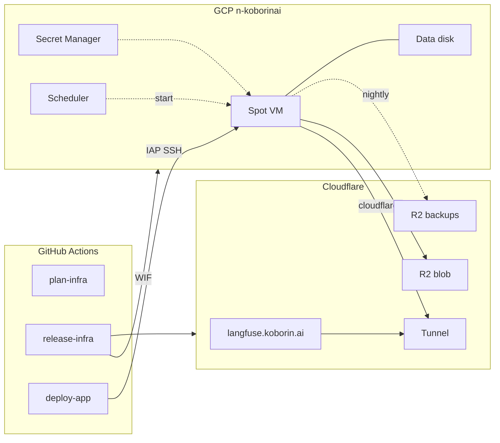

# koborin-ai/langfuse

Self-hosted [Langfuse](https://langfuse.com) at `https://langfuse.koborin.ai`: one GCE Spot VM running Docker Compose, reachable only through a Cloudflare Tunnel.

Infrastructure is a TerraDart stack applied from GitHub Actions. The Compose project is shipped to the VM by GitHub Actions too. Nothing is applied or deployed from a laptop.

## Architecture



| Abbreviation | Full Name | Description |
| --- | --- | --- |
| WIF | [Workload Identity Federation](https://cloud.google.com/iam/docs/workload-identity-federation-with-deployment-pipelines) | GitHub OIDC tokens exchanged for a GCP service account; no key files |
| IAP | [Identity-Aware Proxy TCP forwarding](https://cloud.google.com/iap/docs/using-tcp-forwarding) | The only path to port 22; the VM has no public IP |
| Tunnel | [Cloudflare Tunnel](https://developers.cloudflare.com/cloudflare-one/connections/connect-networks/) | `cloudflared` on the VM dials out; Cloudflare routes the hostname to `langfuse-web:3000` |
| Access | [Cloudflare Access](https://developers.cloudflare.com/cloudflare-one/policies/access/) | Keeps the UI owner-only while `/api/public/*` stays open for SDKs |
| R2 | [Cloudflare R2](https://developers.cloudflare.com/r2/) | Langfuse blob storage, nightly backups, and Terraform state |
| Scheduler | [Cloud Scheduler](https://cloud.google.com/scheduler/docs) | Calls `instances.start` every 5 minutes to recover from Spot preemption |

### What runs where

| Piece | Where | Managed by |
| --- | --- | --- |
| VPC, Cloud NAT, IAP-only firewall | `asia-northeast1` | `infra/` (Terraform) |
| VM `langfuse` (`t2d-standard-4` Spot, 20 GB boot) | `asia-northeast1-b` | `infra/` |
| Data disk `langfuse-data` (100 GB, daily snapshots, 7 days) | same zone | `infra/` |
| VM boot: mount disk, install Docker and Ops Agent, start Compose | `infra/vm/startup.sh` | instance metadata |
| Langfuse web and worker, Postgres 17, ClickHouse 25.12, Redis 7, cloudflared | Docker Compose on the VM | `deploy/` via `deploy-app.yml` |
| Tunnel, DNS CNAME, Access apps, R2 buckets | Cloudflare | `infra/` |
| App secrets (`.env`) | Secret Manager `langfuse-env` | added by hand (never in state) |
| Tunnel token | Secret Manager `cloudflared-token` | `infra/` (write-only attribute) |
| Uptime, disk, and memory alerts | Cloud Monitoring | `infra/` |

## Repository layout

| Path | Purpose |
| --- | --- |
| `.tool-versions` | Dart, Terraform, actionlint, shellcheck versions. The only place they are declared. |
| `mise.toml` | `check` task tree: infra, automation, deploy (Compose), docs. |
| `infra/lib/langfuse_stack.dart` | The whole stack: GCP and Cloudflare resources in one file. |
| `infra/bin/synth.dart` | Synth entry point and the environment constants (project, zone, hostname). Emits `tf-out/langfuse/main.tf.json`. |
| `infra/vm/` | `startup.sh` / `shutdown.sh`, embedded in instance metadata at synth time. |
| `infra/test/` | `dart test` coverage for the synthesized Terraform JSON. |
| `deploy/compose.yaml` | Upstream Langfuse v4.46.0 Compose with the documented differences in its header. |
| `deploy/env.example` | Keys of the `langfuse-env` secret. Values never live in git. |
| `deploy/bin/` | `install.sh` (deploy entry point), `up.sh` (render `.env`, `compose up`), `backup.sh` (Postgres and ClickHouse to R2). |
| `deploy/systemd/` | Nightly backup timer. |
| `.github/workflows/` | `plan-infra`, `release-infra`, `deploy-app`, `automation-ci`. |
| `.github/scripts/tf-plan-summary.sh` | Silent `terraform plan` that logs only action and address per resource. |
| `.github/scripts/r2-state-credentials.sh` | Derives the R2 state-backend S3 keys from the Cloudflare API token. |
| `scripts/setup-github.sh` | Repository settings, variables, secrets, environments, branch protection (`gh`). |
| `scripts/bootstrap-gcp.sh` | APIs, Workload Identity Federation, planner and deployer service accounts (`gcloud`). |
| `scripts/create-langfuse-env.sh` | Generates the app `.env` straight into Secret Manager, once. |

## CI/CD

| Workflow | Trigger | What it does |
| --- | --- | --- |
| `plan-infra.yml` | same-repo PR touching `infra/`, toolchain, or itself | `mise run check:infra`, synth, read-only WIF auth, `terraform plan`; logs and job summary list changed addresses only |
| `release-infra.yml` | push to `main` touching `infra/`, manual (from `main` only) | Same checks, then apply of the saved plan and a no-drift plan. Environment `production (infra)` |
| `deploy-app.yml` | push to `main` touching `deploy/`, after a successful `release-infra` on `main`, manual (from `main` only) | Starts the VM if stopped, waits for the startup script, snapshots the data disk, copies `deploy/` over IAP SSH, runs `install.sh`, checks the public health endpoint. Environment `production (app)` |
| `automation-ci.yml` | PR touching workflows, scripts, Compose, or docs | actionlint, shellcheck, `docker compose config`, markdownlint |

Langfuse upgrades are Dependabot PRs against `deploy/compose.yaml`. Read the release notes, merge, and `deploy-app.yml` snapshots the disk before pulling the new images. Langfuse runs its own migrations on start.

### Public-repository safeguards

This repository is public, and so are its Actions logs.

- **No secrets in git**: app secrets live in Secret Manager; CI has exactly two GitHub secrets, the Cloudflare API token and the owner email. The owner's email is a sensitive Terraform variable (`TF_VAR_owner_email` from the `LANGFUSE_OWNER_EMAIL` secret), never a literal in code or synth output.
- **Fork PRs get nothing**: every workflow uses `pull_request`, never `pull_request_target`, so fork runs receive no secrets and no OIDC token. `plan-infra` additionally skips fork PRs. Workflows default to `permissions: {}` and check out without persisted credentials.
- **Apply and deploy only from `main`**: `release-infra` and `deploy-app` refuse any other ref, run in protected environments, and authenticate as `langfuse-deployer`, which only trusts OIDC tokens with `ref == refs/heads/main`. PR plans use `langfuse-planner`, which is read-only.
- **No plan diffs in logs**: `.github/scripts/tf-plan-summary.sh` runs `terraform plan -out` silently and prints only action and address per resource; apply uses the saved plan, so it prints progress lines, not values. Plan files are deleted and never uploaded as artifacts.

## Setup

Everything except two Cloudflare dashboard steps is scripted, so an agent with the right credentials can run it end to end.

### Cloudflare token

CI uses one Cloudflare API token for the provider and, through `.github/scripts/r2-state-credentials.sh`, for the R2 state backend ([Access Key ID = token ID, Secret = SHA-256 of the token](https://developers.cloudflare.com/r2/api/tokens/#get-s3-api-credentials-from-an-api-token)). Create it as an account API token (Manage Account > Account API Tokens) or a user token, with:

| Scope | Permission | Why |
| --- | --- | --- |
| Account | Cloudflare Tunnel: Edit | Tunnel, its config, and its token |
| Account | Access: Apps and Policies: Edit | Access apps and policies |
| Account | Workers R2 Storage: Edit | `langfuse-*` buckets, and S3 access to the state bucket `koborin-ai-tfstate` |
| Zone `koborin.ai` | DNS: Edit | `langfuse` CNAME |
| Zone `koborin.ai` | Zone: Read | Zone lookup |

### Steps

| # | Who | What |
| --- | --- | --- |
| 1 | You (dashboard) | Cloudflare Zero Trust: enable the Free plan and pick a team name. Create the token above. |
| 2 | Agent | `scripts/setup-github.sh` with `GH_TOKEN` (repo admin), `CLOUDFLARE_ACCOUNT_ID`, `CLOUDFLARE_API_TOKEN`, `LANGFUSE_OWNER_EMAIL`. Sets variables and secrets, makes the repository public, restricts both environments to `main`, protects `main`, and sets Actions to read-only tokens with approval for external fork PRs. |
| 3 | Agent | `scripts/bootstrap-gcp.sh` as a project owner of `n-koborinai`. Idempotent; re-running upgrades an earlier bootstrap (adds the planner, pins the provider to the repository ID, binds the deployer to `main` only). |
| 4 | You | Merge this repository's setup PR. `release-infra` creates the VM, tunnel, DNS, Access, and R2 buckets; the follow-up `deploy-app` run stops at "Require an app .env". |
| 5 | You (dashboard) | R2 > Manage API tokens: create a token with **Object Read & Write** on `langfuse-blob` and `langfuse-backups` only. |
| 6 | Agent | `scripts/create-langfuse-env.sh` with `CLOUDFLARE_ACCOUNT_ID`, `LANGFUSE_OWNER_EMAIL`, and the step 5 keys as `R2_APP_ACCESS_KEY_ID` / `R2_APP_SECRET_ACCESS_KEY`. Then `gh workflow run deploy-app.yml --repo koborin-ai/langfuse`. |
| 7 | You | Open `https://langfuse.koborin.ai`, pass Access with the one-time PIN sent to the owner email, and sign in with the owner email and the generated password (see below). |

Reading the generated admin password (it exists only in Secret Manager):

```bash
gcloud secrets versions access latest --secret=langfuse-env --project=n-koborinai \
  | grep '^LANGFUSE_INIT_USER_PASSWORD='
```

Keep an offline copy of `SALT` and `ENCRYPTION_KEY` from the same secret; losing them breaks stored API keys and encrypted LLM credentials.

Send traces with a v4-compatible SDK or any OTLP exporter to `https://langfuse.koborin.ai/api/public/otel` using the `showcase` project's API keys (`LANGFUSE_INIT_PROJECT_PUBLIC_KEY` / `_SECRET_KEY` in the same secret). Langfuse v4 rejects the legacy `trace-create` ingestion events.

### Notes

- T2D was confirmed in `asia-northeast1-a`, `-b`, and `-c` (2026-09); the stack uses `-b`. Check with `gcloud compute machine-types list --filter="name=t2d-standard-4 AND zone~asia-northeast1"` and change `zone` in `infra/bin/synth.dart` plus `ZONE` in `deploy-app.yml` if that changes.
- Terraform state is in the existing R2 bucket `koborin-ai-tfstate` under `terraform/langfuse/terraform.tfstate`; there is no GCS state bucket.
- Google sign-in is optional and can come later: create an OAuth client with callback `https://langfuse.koborin.ai/api/auth/callback/google`, add `AUTH_GOOGLE_CLIENT_ID` / `AUTH_GOOGLE_CLIENT_SECRET` to a new `langfuse-env` version, and run **Deploy Langfuse**.
- Optional budget alert: budgets live on the billing account, so the caller needs `roles/billing.costsManager` (or Billing Account Administrator) there; project Owner is not enough. Use the billing account's currency:

```bash
BILLING_ACCOUNT="$(gcloud billing projects describe n-koborinai --format='value(billingAccountName)' | cut -d/ -f2)"
gcloud billing budgets create \
  --billing-account="${BILLING_ACCOUNT}" \
  --display-name="n-koborinai monthly" \
  --budget-amount=70USD \
  --filter-projects="projects/n-koborinai" \
  --threshold-rule=percent=0.5 \
  --threshold-rule=percent=0.9 \
  --threshold-rule=percent=1.0
```

## Operations

- **Change app config**: add a new `langfuse-env` version (start from `gcloud secrets versions access latest` and edit one value), then run **Deploy Langfuse**.
- **Spot vs on-demand**: flip `spot` in `infra/bin/synth.dart` and open a PR. Use this if Spot capacity runs out (the uptime alert fires and Scheduler keeps failing).
- **Open the UI to the public** (public trace links for anonymous visitors): set `gateUiWithAccess: false` in `infra/bin/synth.dart`. Before that, confirm `AUTH_DISABLE_SIGNUP=true`, and consider a WAF rate-limit rule on `/api/auth/*` (not managed here yet).
- **Backups**: daily data-disk snapshots at 18:00 UTC (7 days), a snapshot before every deploy (newest 3 kept), and a nightly `pg_dump` plus ClickHouse `BACKUP` to R2 `langfuse-backups` (30-day lifecycle).
- **Restore from a snapshot**: create a disk from the snapshot, stop the VM, swap the attached disk in the console or by importing it as `langfuse-data` in a PR, and start the VM. The startup script mounts it and brings Compose up.
- **Logs**: `gcloud compute ssh langfuse --zone asia-northeast1-b --tunnel-through-iap -- sudo docker compose -f /mnt/disks/data/langfuse/deploy/compose.yaml logs -f langfuse-web`. Read-only inspection over IAP is fine; changes go through PRs.

## Local checks

```bash
curl https://mise.run | sh
mise install
mise run check   # dart analyze/test, actionlint, shellcheck, compose config, markdownlint
```

`check:deploy` needs Docker. Never run `terraform apply` locally.
