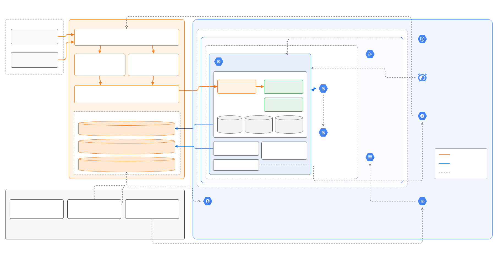
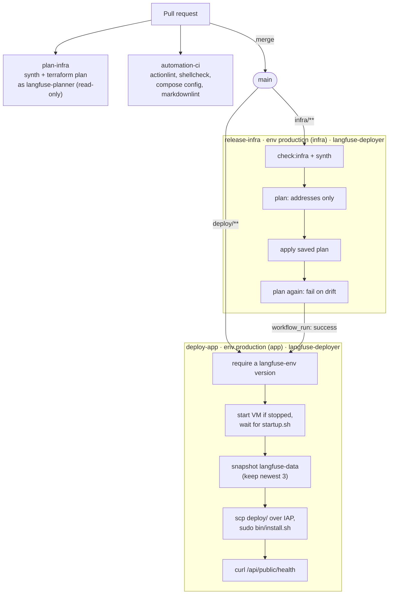

# koborin-ai/langfuse

Self-hosted [Langfuse](https://langfuse.com) v4 at `https://langfuse.koborin.ai`, for koborin.ai demos and experiments.

One GCE Spot VM in `n-koborinai` runs the upstream Docker Compose stack. The VM has no public IP; browsers and SDKs reach it only through a Cloudflare Tunnel, and the UI sits behind Cloudflare Access. Infrastructure is a [TerraDart](https://pub.dev/packages/terradart_core) stack, and both Terraform apply and app deploys run only in GitHub Actions on `main`.

## Architecture



Source: [`docs/architecture.drawio`](docs/architecture.drawio) (Cloudflare orange, GCP blue, GitHub black, as in the [org overview](https://github.com/koborin-ai/.github)). After editing, export `docs/architecture.svg` with the light theme (`drawio -x -f svg --svg-theme light -b 20`) and strip the embedded PNG text fallbacks to keep the file small.

- **UI requests**: browser → Cloudflare edge → Access app `Langfuse UI` (owner email only, one-time PIN, 24 h session) → Tunnel → `cloudflared` on the VM → `langfuse-web:3000` over the Compose network. Port 3000 is never published on the host.
- **SDK / OTLP requests**: `/api/public/*` matches a more specific Access app with a bypass policy, so SDKs authenticate with Langfuse API keys only. Same tunnel path after that.
- **No inbound ports**: the VPC has no external IPs. `cloudflared` dials out, and egress (Docker Hub, R2, Google APIs) goes through Cloud NAT. SSH is allowed only from the IAP range, via OS Login.
- **State**: Postgres, ClickHouse, Redis, and the deployed Compose files live on the `langfuse-data` disk (`prevent_destroy`, daily snapshots), so the VM can be recreated freely. Trace events, media, and batch exports go to R2 `langfuse-blob`; nightly dumps go to R2 `langfuse-backups`.
- **Secrets**: the app `.env` is Secret Manager `langfuse-env` (versions added by hand, never in Terraform state). The tunnel token is `cloudflared-token`, written by Terraform through a write-only attribute. `deploy/bin/up.sh` renders both into `deploy/.env` on every boot and deploy.
- **Spot recovery**: preemption stops (not deletes) the VM. Cloud Scheduler calls `instances.start` every 5 minutes, and the startup script brings Compose back up.
- **Alerts** (email to the owner): uptime check on `/api/public/health` failing for 15 minutes, disk above 80%, memory above 90%.

### CI/CD



All jobs authenticate to GCP with Workload Identity Federation (GitHub OIDC, no service-account keys): `langfuse-planner` is read-only and usable from any ref; `langfuse-deployer` only from `refs/heads/main`.

`bin/install.sh` rsyncs `deploy/` onto the data disk (keeping `.env` out of the sync), records the revision, and runs `bin/up.sh --pull`, which re-renders `.env`, installs the backup timer, and runs `docker compose up -d --wait`. Compose recreates only the services whose image or config changed.

This repository and its Actions logs are public, so:

- Workflows use `pull_request`, never `pull_request_target`; fork PRs get no secrets or OIDC token, and `plan-infra` skips them. Workflows default to `permissions: {}`.
- Apply and deploy refuse non-`main` refs, run in environments restricted to `main`, and `langfuse-deployer` only trusts OIDC tokens with `ref == refs/heads/main`.
- `.github/scripts/tf-plan-summary.sh` prints only action and address per resource; plan files are deleted, never uploaded.
- CI has two secrets: `CLOUDFLARE_API_TOKEN` (the R2 state credentials are derived from it by `.github/scripts/r2-state-credentials.sh`) and `LANGFUSE_OWNER_EMAIL` (the sensitive Terraform variable `owner_email`).

## Repository layout

| Path | Purpose |
| --- | --- |
| `infra/lib/langfuse_stack.dart` | The whole stack: every GCP and Cloudflare resource, in one file. |
| `infra/bin/synth.dart` | Environment constants (project, zone, machine type, `spot`, hostname, `gateUiWithAccess`) and the R2 state backend. Emits `infra/tf-out/langfuse/main.tf.json`. |
| `infra/vm/` | `startup.sh` / `shutdown.sh`, embedded in instance metadata at synth time. |
| `infra/test/` | `dart test` coverage of the synthesized Terraform JSON. |
| `deploy/compose.yaml` | Upstream Langfuse Compose file; its header lists every local difference. |
| `deploy/env.example` | Keys of the `langfuse-env` secret, without values. |
| `deploy/bin/` | `install.sh` (deploy entry point), `up.sh` (render `.env`, `compose up`), `backup.sh` (Postgres and ClickHouse to R2). |
| `deploy/systemd/` | `langfuse-backup.timer` / `.service`. |
| `.github/workflows/` | `plan-infra`, `release-infra`, `deploy-app`, `automation-ci`. |
| `.github/scripts/` | Plan summary and R2 state-credential helpers used by the infra workflows. |
| `scripts/` | One-time bootstrap scripts (see below). |
| `docs/` | Architecture diagram: draw.io source and SVG export. |
| `.tool-versions`, `mise.toml` | Pinned toolchain and the `mise run check` task tree. |

## How changes flow

| You change | What happens after merge to `main` |
| --- | --- |
| `infra/**` (including `infra/vm/*.sh`) | `release-infra` applies, checks for drift, then triggers `deploy-app`. Boot-script edits update instance metadata in place and take effect on the next boot. |
| `deploy/**` | `deploy-app` snapshots the disk and ships the new files. |
| `langfuse-env` secret | Nothing automatic. Run **Deploy Langfuse** (`gh workflow run deploy-app.yml --repo koborin-ai/langfuse`) or wait for the next boot. |
| Docs, toolchain, other workflows | Checks on the PR; nothing is applied or deployed. |

Never run `terraform apply` or `docker compose` changes from a laptop. Read-only inspection over IAP SSH is fine.

## Day-2 operations

### Upgrade Langfuse

Dependabot opens weekly PRs for the images in `deploy/compose.yaml` (the two Langfuse images are grouped; major versions are ignored). Read the [Langfuse release notes](https://github.com/langfuse/langfuse/releases), merge, and `deploy-app` snapshots the disk before pulling. Langfuse runs its own Postgres and ClickHouse migrations on start.

For a manual bump, change both `langfuse/langfuse` and `langfuse/langfuse-worker` tags and the upstream version in the file header, and re-check the header's list of differences against the new upstream `docker-compose.yml`. Majors (Langfuse v5, Postgres 18) need a migration plan in the PR.

### Admin password and API keys

The admin user, the `koborin.ai` org, and the `showcase` project with its API keys are created by headless init from `langfuse-env`:

```bash
gcloud secrets versions access latest --secret=langfuse-env --project=n-koborinai \
  | grep -E '^(LANGFUSE_INIT_USER_EMAIL|LANGFUSE_INIT_USER_PASSWORD|LANGFUSE_INIT_PROJECT_PUBLIC_KEY|LANGFUSE_INIT_PROJECT_SECRET_KEY)='
```

Sign-up is closed (`AUTH_DISABLE_SIGNUP=true`). Pass Cloudflare Access with the one-time PIN sent to the owner email, then sign in with email and password.

### Backups and restore

| Layer | When | Retention | Where |
| --- | --- | --- | --- |
| Data-disk snapshot | Daily 18:00 UTC (resource policy) | 7 days | GCE snapshots, `asia-northeast1` |
| Pre-deploy snapshot | Every `deploy-app` run | Newest 3 (`labels.kind=predeploy`) | GCE snapshots |
| `pg_dump -Fc` + ClickHouse `BACKUP DATABASE default` | Daily 19:00 UTC (`langfuse-backup.timer`) | 30 days (bucket lifecycle) | R2 `langfuse-backups` (`postgres/`, `clickhouse/`) |

Trace blobs in R2 `langfuse-blob` are not backed up separately.

- **From a snapshot** (whole disk): create a disk from the snapshot, stop the VM, attach it in place of `langfuse-data` (same device name), and start the VM. Make the swap permanent through a PR that imports the new disk as `langfuse-data`; never let Terraform replace the disk.
- **From R2** (off-GCP): on a running stack, `pg_restore` the Postgres dump into the `postgres` container and run `RESTORE DATABASE default FROM S3('<endpoint>/langfuse-backups/clickhouse/<stamp>/', '<key>', '<secret>')` in ClickHouse. `deploy/bin/backup.sh` shows the exact endpoints and credentials it uses.

### Spot preemption

1. GCE sends the preemption notice; `infra/vm/shutdown.sh` runs `docker compose stop -t 25` so the databases shut down cleanly within the ~30 s window.
2. The VM is stopped (`instance_termination_action = STOP`); disks are kept.
3. Cloud Scheduler `langfuse-start-vm` calls `instances.start` every 5 minutes (a no-op while running) until capacity returns.
4. `infra/vm/startup.sh` mounts the data disk and runs `deploy/bin/up.sh`, which re-renders `.env` and starts Compose.

The uptime alert allows 15 minutes of failures, which covers a normal preemption. If Spot capacity stays unavailable (the alert fires and restarts keep failing), set `spot: false` in `infra/bin/synth.dart` and open a PR.

### Change configuration or rotate secrets

App config changes are a new `langfuse-env` version followed by **Deploy Langfuse**:

```bash
gcloud secrets versions access latest --secret=langfuse-env --project=n-koborinai >/tmp/langfuse.env
# edit one value
gcloud secrets versions add langfuse-env --project=n-koborinai --data-file=/tmp/langfuse.env
shred -u /tmp/langfuse.env
gh workflow run deploy-app.yml --repo koborin-ai/langfuse
```

| Secret | How to rotate |
| --- | --- |
| `SALT`, `ENCRYPTION_KEY` | Do not rotate. Changing them breaks stored API key hashes and encrypted LLM credentials. Keep an offline copy. |
| `NEXTAUTH_SECRET` | Replace the value; existing sessions are signed out. |
| `POSTGRES_PASSWORD` | Postgres keeps the password it was initialized with. Run `ALTER USER postgres PASSWORD '...'` in the `postgres` container first, then add the new version. |
| `CLICKHOUSE_PASSWORD`, `REDIS_AUTH` | Replace the value; the deploy recreates the containers with it. |
| `R2_ACCESS_KEY_ID` / `R2_SECRET_ACCESS_KEY` | Create a new R2 token (Object Read & Write on `langfuse-blob` and `langfuse-backups` only), add the version, deploy, then revoke the old token. |
| Project API keys | Create new keys in the Langfuse UI and delete the old ones. `LANGFUSE_INIT_*` never overwrites existing resources. |
| `cloudflared-token` | Managed by Terraform; a replaced tunnel forces a new version automatically. |
| `CLOUDFLARE_API_TOKEN` (GitHub secret) | Create a token with the scopes below, `gh secret set CLOUDFLARE_API_TOKEN --repo koborin-ai/langfuse`, then revoke the old one. The R2 state keys follow automatically. |

Google sign-in is available but off: add `AUTH_GOOGLE_CLIENT_ID` / `AUTH_GOOGLE_CLIENT_SECRET` (callback `https://langfuse.koborin.ai/api/auth/callback/google`) the same way.

### Other switches

- **Public UI** (anonymous visitors on shared trace links): `gateUiWithAccess: false` in `infra/bin/synth.dart` removes both Access apps. Keep sign-up closed and consider a WAF rate limit on `/api/auth/*` (not managed here) first.
- **Logs**:

  ```bash
  gcloud compute ssh langfuse --zone asia-northeast1-b --project n-koborinai --tunnel-through-iap -- \
    sudo docker compose -f /mnt/disks/data/langfuse/deploy/compose.yaml logs -f langfuse-web
  ```

## Sending traces

| Setting | Value |
| --- | --- |
| Host (`LANGFUSE_HOST` / `LANGFUSE_BASE_URL`) | `https://langfuse.koborin.ai` |
| OTLP endpoint (HTTP) | `https://langfuse.koborin.ai/api/public/otel` (traces: `/api/public/otel/v1/traces`) |
| OTLP auth header | `Authorization: Basic <base64 of public_key:secret_key>` |
| Keys | `showcase` project keys (see [Admin password and API keys](#admin-password-and-api-keys)) or keys created in the UI |

```bash
export OTEL_EXPORTER_OTLP_ENDPOINT="https://langfuse.koborin.ai/api/public/otel"
export OTEL_EXPORTER_OTLP_HEADERS="Authorization=Basic $(printf '%s:%s' "$LANGFUSE_PUBLIC_KEY" "$LANGFUSE_SECRET_KEY" | base64 -w0)"
```

Langfuse v4 ingests traces over OTLP only: use the OpenTelemetry-based Langfuse SDKs (Python v3+, JS/TS v4+) or any OTLP/HTTP exporter. The legacy batch ingestion events (`trace-create` and friends) are rejected, and OTLP/gRPC is not supported. No Cloudflare Access token is needed, because `/api/public/*` bypasses Access.

## Local checks

```bash
curl https://mise.run | sh
mise install
mise run check   # dart analyze/test, actionlint, shellcheck, compose config, markdownlint
```

`check:deploy` needs Docker.

## One-time bootstrap

<details>
<summary>Reference for rebuilding from an empty project. Already done for <code>n-koborinai</code>.</summary>

Every script is idempotent unless noted.

1. **Cloudflare dashboard**: enable Zero Trust (Free plan, pick a team name) and create the CI API token with the scopes below.
2. **`scripts/setup-github.sh`** (needs `gh` as repo admin, `CLOUDFLARE_ACCOUNT_ID`, `CLOUDFLARE_API_TOKEN`, `LANGFUSE_OWNER_EMAIL`): variables, secrets, public visibility, `main`-only environments, branch protection, read-only Actions token, approval for external fork PRs.
3. **`scripts/bootstrap-gcp.sh`** (project owner): APIs, the Workload Identity pool and provider pinned to this repository's ID, `langfuse-planner` and `langfuse-deployer` with their roles.
4. **Merge to `main`**: `release-infra` creates everything in the diagram; the first `deploy-app` stops at "Require an app .env".
5. **Cloudflare dashboard**: create an R2 token with Object Read & Write on `langfuse-blob` and `langfuse-backups` only.
6. **`scripts/create-langfuse-env.sh`** (`CLOUDFLARE_ACCOUNT_ID`, `LANGFUSE_OWNER_EMAIL`, `R2_APP_ACCESS_KEY_ID`, `R2_APP_SECRET_ACCESS_KEY`): generates the `.env` straight into `langfuse-env`. Runs once; refuses if a version exists. Then run **Deploy Langfuse**.

### Cloudflare API token

One token serves the Terraform provider and, through `.github/scripts/r2-state-credentials.sh`, the R2 state backend ([Access Key ID = token ID, Secret = SHA-256 of the token](https://developers.cloudflare.com/r2/api/tokens/#get-s3-api-credentials-from-an-api-token)). Account API token or user token:

| Scope | Permission | Why |
| --- | --- | --- |
| Account | Cloudflare Tunnel: Edit | Tunnel, its config, and its token |
| Account | Access: Apps and Policies: Edit | Access apps and policies |
| Account | Workers R2 Storage: Edit | `langfuse-*` buckets and the state bucket `koborin-ai-tfstate` |
| Zone `koborin.ai` | DNS: Edit | `langfuse` CNAME |
| Zone `koborin.ai` | Zone: Read | Zone lookup |

### Notes

- Terraform state: R2 `koborin-ai-tfstate`, key `terraform/langfuse/terraform.tfstate`.
- T2D is available in `asia-northeast1-a`, `-b`, and `-c` (checked 2026-09). To move zones, change `zone` in `infra/bin/synth.dart` and `ZONE` in `deploy-app.yml`.
- An optional budget alert lives on the billing account and needs `roles/billing.costsManager` there: `gcloud billing budgets create --billing-account=<id> --display-name="n-koborinai monthly" --budget-amount=70USD --filter-projects=projects/n-koborinai --threshold-rule=percent=0.5 --threshold-rule=percent=0.9 --threshold-rule=percent=1.0`.

</details>
