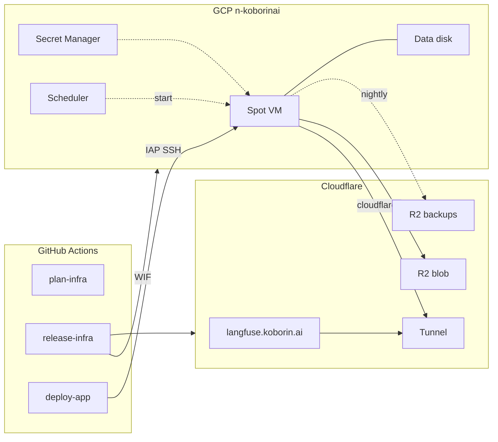

# koborin-ai/langfuse

Self-hosted [Langfuse](https://langfuse.com) at `https://langfuse.koborin.ai`: one GCE Spot VM running Docker Compose, reachable only through a Cloudflare Tunnel.

Infrastructure is a TerraDart stack applied from GitHub Actions. The Compose project is shipped to the VM by GitHub Actions too. Nothing is applied or deployed from a laptop.

## Architecture



| Abbreviation | Full Name | Description |
| --- | --- | --- |
| WIF | [Workload Identity Federation](https://cloud.google.com/iam/docs/workload-identity-federation-with-deployment-pipelines) | GitHub OIDC tokens exchanged for a GCP service account; no key files |
| IAP | [Identity-Aware Proxy TCP forwarding](https://cloud.google.com/iap/docs/using-tcp-forwarding) | The only path to port 22; the VM has no public IP |
| Tunnel | [Cloudflare Tunnel](https://developers.cloudflare.com/cloudflare-one/connections/connect-networks/) | `cloudflared` on the VM dials out; Cloudflare routes the hostname to `langfuse-web:3000` |
| Access | [Cloudflare Access](https://developers.cloudflare.com/cloudflare-one/policies/access/) | Keeps the UI owner-only while `/api/public/*` stays open for SDKs |
| R2 | [Cloudflare R2](https://developers.cloudflare.com/r2/) | Langfuse blob storage, nightly backups, and Terraform state |
| Scheduler | [Cloud Scheduler](https://cloud.google.com/scheduler/docs) | Calls `instances.start` every 5 minutes to recover from Spot preemption |

### What runs where

| Piece | Where | Managed by |
| --- | --- | --- |
| VPC, Cloud NAT, IAP-only firewall | `asia-northeast1` | `infra/` (Terraform) |
| VM `langfuse` (`t2d-standard-4` Spot, 20 GB boot) | `asia-northeast1-b` | `infra/` |
| Data disk `langfuse-data` (100 GB, daily snapshots, 7 days) | same zone | `infra/` |
| VM boot: mount disk, install Docker and Ops Agent, start Compose | `infra/vm/startup.sh` | instance metadata |
| Langfuse web and worker, Postgres 17, ClickHouse 25.12, Redis 7, cloudflared | Docker Compose on the VM | `deploy/` via `deploy-app.yml` |
| Tunnel, DNS CNAME, Access apps, R2 buckets | Cloudflare | `infra/` |
| App secrets (`.env`) | Secret Manager `langfuse-env` | added by hand (never in state) |
| Tunnel token | Secret Manager `cloudflared-token` | `infra/` (write-only attribute) |
| Uptime, disk, and memory alerts | Cloud Monitoring | `infra/` |

## Repository layout

| Path | Purpose |
| --- | --- |
| `.tool-versions` | Dart, Terraform, actionlint, shellcheck versions. The only place they are declared. |
| `mise.toml` | `check` task tree: infra, automation, deploy (Compose), docs. |
| `infra/lib/langfuse_stack.dart` | The whole stack: GCP and Cloudflare resources in one file. |
| `infra/bin/synth.dart` | Synth entry point and the environment constants (project, zone, hostname). Emits `tf-out/langfuse/main.tf.json`. |
| `infra/vm/` | `startup.sh` / `shutdown.sh`, embedded in instance metadata at synth time. |
| `infra/test/` | `dart test` coverage for the synthesized Terraform JSON. |
| `deploy/compose.yaml` | Upstream Langfuse v4.46.0 Compose with the documented differences in its header. |
| `deploy/env.example` | Keys of the `langfuse-env` secret. Values never live in git. |
| `deploy/bin/` | `install.sh` (deploy entry point), `up.sh` (render `.env`, `compose up`), `backup.sh` (Postgres and ClickHouse to R2). |
| `deploy/systemd/` | Nightly backup timer. |
| `.github/workflows/` | `plan-infra`, `release-infra`, `deploy-app`, `automation-ci`. |
| `.github/scripts/tf-plan-summary.sh` | Silent `terraform plan` that logs only action and address per resource. |

## CI/CD

| Workflow | Trigger | What it does |
| --- | --- | --- |
| `plan-infra.yml` | same-repo PR touching `infra/`, toolchain, or itself | `mise run check:infra`, synth, read-only WIF auth, `terraform plan`; logs and job summary list changed addresses only |
| `release-infra.yml` | push to `main` touching `infra/`, manual (from `main` only) | Same checks, then apply of the saved plan and a no-drift plan. Environment `production (infra)` |
| `deploy-app.yml` | push to `main` touching `deploy/`, after a successful `release-infra` on `main`, manual (from `main` only) | Starts the VM if stopped, waits for the startup script, snapshots the data disk, copies `deploy/` over IAP SSH, runs `install.sh`, checks the public health endpoint. Environment `production (app)` |
| `automation-ci.yml` | PR touching workflows, scripts, Compose, or docs | actionlint, shellcheck, `docker compose config`, markdownlint |

Langfuse upgrades are Dependabot PRs against `deploy/compose.yaml`. Read the release notes, merge, and `deploy-app.yml` snapshots the disk before pulling the new images. Langfuse runs its own migrations on start.

### Public-repository safeguards

This repository is public, and so are its Actions logs.

- **No secrets in git**: app secrets live in Secret Manager; CI credentials live in GitHub secrets. The owner's email is a sensitive Terraform variable (`TF_VAR_owner_email` from the `LANGFUSE_OWNER_EMAIL` secret), never a literal in code or synth output.
- **Fork PRs get nothing**: every workflow uses `pull_request`, never `pull_request_target`, so fork runs receive no secrets and no OIDC token. `plan-infra` additionally skips fork PRs. Workflows default to `permissions: {}` and check out without persisted credentials.
- **Apply and deploy only from `main`**: `release-infra` and `deploy-app` refuse any other ref, run in protected environments, and authenticate as `langfuse-deployer`, which only trusts OIDC tokens with `ref == refs/heads/main`. PR plans use `langfuse-planner`, which is read-only.
- **No plan diffs in logs**: `.github/scripts/tf-plan-summary.sh` runs `terraform plan -out` silently and prints only action and address per resource; apply uses the saved plan, so it prints progress lines, not values. Plan files are deleted and never uploaded as artifacts.

## One-time bootstrap

Everything in this section happens once, by hand, because it is what CI needs before it can authenticate. Run the `gcloud` commands as a project owner of `n-koborinai`.

### 1. Check that T2D exists in the chosen zone

```bash
gcloud compute machine-types list \
  --filter="name=t2d-standard-4 AND zone~asia-northeast1" \
  --format="value(zone)"
```

As of the first bootstrap (2026-09) it is offered in `asia-northeast1-a`, `-b`, and `-c`; the stack uses `-b`. If that changes, set `zone` in `infra/bin/synth.dart` and `ZONE` in `.github/workflows/deploy-app.yml` to a listed zone.

### 2. GCP: APIs, Workload Identity Federation, two service accounts

The provider only accepts tokens from this repository, pinned by its immutable ID (`1388592925`) so a deleted-and-recreated repository with the same name is not trusted. On top of that:

- `langfuse-planner` (read-only) is usable from any ref of this repository, for PR plans.
- `langfuse-deployer` (read-write) is usable only from `refs/heads/main`, for apply and deploy.

```bash
PROJECT_ID=n-koborinai
PROJECT_NUMBER=98679215902
REPO=koborin-ai/langfuse
REPO_ID=1388592925
POOL=github-actions-pool
PROVIDER=koborin-ai-langfuse
POOL_PATH="projects/${PROJECT_NUMBER}/locations/global/workloadIdentityPools/${POOL}"
PLANNER="langfuse-planner@${PROJECT_ID}.iam.gserviceaccount.com"
DEPLOYER="langfuse-deployer@${PROJECT_ID}.iam.gserviceaccount.com"

gcloud config set project "${PROJECT_ID}"

gcloud services enable \
  iam.googleapis.com iamcredentials.googleapis.com sts.googleapis.com \
  cloudresourcemanager.googleapis.com serviceusage.googleapis.com \
  compute.googleapis.com iap.googleapis.com oslogin.googleapis.com \
  secretmanager.googleapis.com cloudscheduler.googleapis.com \
  monitoring.googleapis.com logging.googleapis.com

# Reuse the pool if koborin-ai/site created it earlier. A deleted pool still
# answers `describe` (state DELETED, kept 30 days) and must be undeleted.
pool_state="$(gcloud iam workload-identity-pools describe "${POOL}" \
  --location=global --format='value(state)' 2>/dev/null || true)"
case "${pool_state}" in
  ACTIVE) ;;
  DELETED) gcloud iam workload-identity-pools undelete "${POOL}" --location=global ;;
  *) gcloud iam workload-identity-pools create "${POOL}" \
       --location=global --display-name="GitHub Actions" ;;
esac

# Same for the provider; `update-oidc` also brings an existing provider up to
# the current mapping and condition.
provider_flags=(
  --location=global
  --workload-identity-pool="${POOL}"
  --display-name="koborin-ai/langfuse"
  --issuer-uri="https://token.actions.githubusercontent.com"
  --attribute-mapping="google.subject=assertion.sub,attribute.repository=assertion.repository,attribute.ref=assertion.ref"
  --attribute-condition="assertion.repository == '${REPO}' && assertion.repository_id == '${REPO_ID}'"
)
provider_state="$(gcloud iam workload-identity-pools providers describe "${PROVIDER}" \
  --location=global --workload-identity-pool="${POOL}" --format='value(state)' 2>/dev/null || true)"
case "${provider_state}" in
  DELETED)
    gcloud iam workload-identity-pools providers undelete "${PROVIDER}" \
      --location=global --workload-identity-pool="${POOL}"
    gcloud iam workload-identity-pools providers update-oidc "${PROVIDER}" "${provider_flags[@]}" ;;
  ACTIVE) gcloud iam workload-identity-pools providers update-oidc "${PROVIDER}" "${provider_flags[@]}" ;;
  *) gcloud iam workload-identity-pools providers create-oidc "${PROVIDER}" "${provider_flags[@]}" ;;
esac

# Read-only planner: any ref of this repository (PR plans).
gcloud iam service-accounts describe "${PLANNER}" >/dev/null 2>&1 ||
  gcloud iam service-accounts create langfuse-planner \
    --display-name="koborin-ai/langfuse plan (read-only)"
gcloud iam service-accounts add-iam-policy-binding "${PLANNER}" \
  --role=roles/iam.workloadIdentityUser \
  --member="principalSet://iam.googleapis.com/${POOL_PATH}/attribute.repository/${REPO}"
for role in roles/viewer roles/iam.securityReviewer roles/secretmanager.viewer; do
  gcloud projects add-iam-policy-binding "${PROJECT_ID}" \
    --member="serviceAccount:${PLANNER}" --role="${role}" --condition=None
done

# Deployer: only tokens whose ref is refs/heads/main (release-infra, deploy-app).
gcloud iam service-accounts describe "${DEPLOYER}" >/dev/null 2>&1 ||
  gcloud iam service-accounts create langfuse-deployer \
    --display-name="koborin-ai/langfuse apply and deploy (main only)"
gcloud iam service-accounts add-iam-policy-binding "${DEPLOYER}" \
  --role=roles/iam.workloadIdentityUser \
  --member="principalSet://iam.googleapis.com/${POOL_PATH}/attribute.ref/refs/heads/main"

for role in \
  roles/compute.admin \
  roles/compute.osAdminLogin \
  roles/iap.tunnelResourceAccessor \
  roles/iam.serviceAccountAdmin \
  roles/iam.serviceAccountUser \
  roles/secretmanager.admin \
  roles/cloudscheduler.admin \
  roles/monitoring.editor \
  roles/serviceusage.serviceUsageAdmin; do
  gcloud projects add-iam-policy-binding "${PROJECT_ID}" \
    --member="serviceAccount:${DEPLOYER}" --role="${role}" --condition=None
done

# Project IAM admin, but only for the two roles the stack grants the VM. The
# expression contains commas, which `--condition=KEY=VALUE,...` would split,
# so it goes through a file.
condition_file="$(mktemp)"
cat >"${condition_file}" <<'EOF'
title: langfuse-vm-roles-only
description: Deployer may grant only the Langfuse VM's logging and metrics roles.
expression: "api.getAttribute('iam.googleapis.com/modifiedGrantsByRole', []).hasOnly(['roles/logging.logWriter', 'roles/monitoring.metricWriter'])"
EOF
gcloud projects add-iam-policy-binding "${PROJECT_ID}" \
  --member="serviceAccount:${DEPLOYER}" \
  --role=roles/resourcemanager.projectIamAdmin \
  --condition-from-file="${condition_file}"
rm -f "${condition_file}"

echo "GCP_WORKLOAD_IDENTITY_PROVIDER=${POOL_PATH}/providers/${PROVIDER}"
echo "GCP_PLAN_SERVICE_ACCOUNT=${PLANNER}"
echo "GCP_SERVICE_ACCOUNT=${DEPLOYER}"
```

The `attribute.ref/refs/heads/main` binding matches any workflow on `main` of this repository (the provider condition already excludes other repositories), so protect `main` as described in step 4.

The whole block is safe to re-run. If the project was bootstrapped with an earlier revision of this README, which let the deployer be impersonated from any ref, also drop that binding:

```bash
gcloud iam service-accounts remove-iam-policy-binding "${DEPLOYER}" \
  --role=roles/iam.workloadIdentityUser \
  --member="principalSet://iam.googleapis.com/${POOL_PATH}/attribute.repository/${REPO}"
```

Terraform state stays in the existing R2 bucket `koborin-ai-tfstate` under `terraform/langfuse/terraform.tfstate`; there is no GCS state bucket to create.

Optional budget alert. Budgets live on the billing account, not the project, so project Owner is not enough: the caller needs `roles/billing.costsManager` (or Billing Account Administrator) on that billing account. Use the billing account's currency, e.g. `10000JPY` for a JPY account:

```bash
BILLING_ACCOUNT="$(gcloud billing projects describe "${PROJECT_ID}" --format='value(billingAccountName)' | cut -d/ -f2)"
gcloud billing budgets create \
  --billing-account="${BILLING_ACCOUNT}" \
  --display-name="n-koborinai monthly" \
  --budget-amount=70USD \
  --filter-projects="projects/${PROJECT_ID}" \
  --threshold-rule=percent=0.5 \
  --threshold-rule=percent=0.9 \
  --threshold-rule=percent=1.0
```

### 3. Cloudflare

1. Zero Trust: enable the Free plan and pick a team name. One-time PIN login works out of the box, so no IdP is needed for the owner-only Access policy.
2. API token for this repository (separate from the site token):
   - Account: Cloudflare Tunnel Edit, Access: Apps and Policies Edit, Workers R2 Storage Edit
   - Zone `koborin.ai`: DNS Edit, Zone Read
3. Terraform state: reuse the site's R2 keys scoped to `koborin-ai-tfstate`, or issue a new pair with Object Read & Write on that bucket only.

### 4. GitHub repository settings

| Kind | Name | Value |
| --- | --- | --- |
| Variable | `CLOUDFLARE_ACCOUNT_ID` | Cloudflare account ID |
| Variable | `GCP_WORKLOAD_IDENTITY_PROVIDER` | Printed by step 2 |
| Variable | `GCP_PLAN_SERVICE_ACCOUNT` | Printed by step 2 (`langfuse-planner`) |
| Variable | `GCP_SERVICE_ACCOUNT` | Printed by step 2 (`langfuse-deployer`) |
| Secret | `LANGFUSE_OWNER_EMAIL` | Address Access admits and alerts are sent to (a secret so it is masked in public logs) |
| Secret | `CLOUDFLARE_API_TOKEN` | Token from step 3 |
| Secret | `R2_ACCESS_KEY_ID` / `R2_SECRET_ACCESS_KEY` | State bucket keys from step 3 |

Protection settings for a public repository:

1. **Environments** `production (infra)` and `production (app)`: Deployment branches and tags = Selected, `main` only. Add yourself as a required reviewer if every apply/deploy should wait for approval.
2. **Branch protection / ruleset on `main`**: require a pull request and block force pushes, so nothing reaches `main` (and the deployer service account) without review.
3. **Actions > General**: Fork pull request workflows = "Require approval for all external contributors"; Workflow permissions = "Read repository contents".
4. **Blacksmith**: grant the Blacksmith GitHub App access to this repository; the workflows run on `blacksmith-*` runners like koborin-ai/site.

### 5. First apply

Merge to `main`. `release-infra.yml` creates everything, the VM boots and prepares itself, and `deploy-app.yml` runs afterwards and stops at "Require an app .env", because the secret has no value yet.

### 6. After the first apply: app secrets

In the R2 dashboard, create two API tokens with Object Read & Write: one on `langfuse-blob`, one on `langfuse-backups`. Create the GitHub OAuth App (callback `https://langfuse.koborin.ai/api/auth/callback/github`), or a Google OAuth client (callback `https://langfuse.koborin.ai/api/auth/callback/google`). Then fill in the secret and upload it:

```bash
cp deploy/env.example /tmp/langfuse.env
# Fill every empty value; use `openssl rand -hex 32` for the generated ones.
${EDITOR:-vi} /tmp/langfuse.env
gcloud secrets versions add langfuse-env --project=n-koborinai --data-file=/tmp/langfuse.env
shred -u /tmp/langfuse.env
```

Keep an offline copy of `SALT` and `ENCRYPTION_KEY`; losing them breaks stored API keys and encrypted LLM credentials.

Finally, run **Deploy Langfuse** (`deploy-app.yml`) from the Actions tab.

### 7. First login

1. Open `https://langfuse.koborin.ai`, pass Access with a one-time PIN sent to `LANGFUSE_OWNER_EMAIL`.
2. Sign in with `LANGFUSE_INIT_USER_EMAIL` / `LANGFUSE_INIT_USER_PASSWORD`, then sign in once with GitHub (or Google) to link the account.
3. Set `AUTH_DISABLE_USERNAME_PASSWORD=true`, add a new secret version, and run **Deploy Langfuse** again.

Send traces with a v4-compatible SDK or any OTLP exporter to `https://langfuse.koborin.ai/api/public/otel` using the project's API keys. Langfuse v4 rejects the legacy `trace-create` ingestion events.

## Operations

- **Change app config**: add a new `langfuse-env` version, then run **Deploy Langfuse**.
- **Spot vs on-demand**: flip `spot` in `infra/bin/synth.dart` and open a PR. Use this if Spot capacity runs out (the uptime alert fires and Scheduler keeps failing).
- **Open the UI to the public** (public trace links for anonymous visitors): set `gateUiWithAccess: false` in `infra/bin/synth.dart`. Before that, confirm `AUTH_DISABLE_SIGNUP=true` and `AUTH_DISABLE_USERNAME_PASSWORD=true`, and consider a WAF rate-limit rule on `/api/auth/*` (not managed here yet).
- **Backups**: daily data-disk snapshots at 18:00 UTC (7 days), a snapshot before every deploy (newest 3 kept), and a nightly `pg_dump` plus ClickHouse `BACKUP` to R2 `langfuse-backups` (30-day lifecycle).
- **Restore from a snapshot**: create a disk from the snapshot, stop the VM, swap the attached disk in the console or by importing it as `langfuse-data` in a PR, and start the VM. The startup script mounts it and brings Compose up.
- **Logs**: `gcloud compute ssh langfuse --zone asia-northeast1-b --tunnel-through-iap -- sudo docker compose -f /mnt/disks/data/langfuse/deploy/compose.yaml logs -f langfuse-web`. Read-only inspection over IAP is fine; changes go through PRs.

## Local checks

```bash
curl https://mise.run | sh
mise install
mise run check   # dart analyze/test, actionlint, shellcheck, compose config, markdownlint
```

`check:deploy` needs Docker. Never run `terraform apply` locally.
